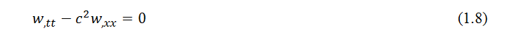

### EXPERIMENTAL METHODOLOGY

<strong>Waves in 1D string

1. Introduction:

</strong>

A string is a one-dimensional elastic continuum that does not transmit or resist bending moment. Such an idealization may be justified even for cable-like components when the ratio of the thickness of the cable to its length (or wavelength of waves in the cable) is small compared to unity. In deriving the elementary equation of motion, it is assumed that the motion of the string is planar, and transverse to its length, i.e., longitudinal motion is neglected. Further, the amplitude of motion is assumed to be small enough so that the change in tension is negligible.

<strong>

2. Theory:

</strong>

Consider a string, stretched along the x-axis to a length l by a tension T, as shown in Figure 1. Arbitrary distributed forces are assumed to act over the length of the string. The transverse motion of any point on the string at the coordinate position x is represented by the field variable w(x,t) where t is the time. Consider the free body diagram of a small element of the string between two closely spaced points x and x +&#8710;x, as shown in Figure 2. Let the element have a mass &#8710;m(x), and a deformed length &#8710;s. The tensions at the two ends are T (x,t) and T (x+&#8710;x,t), respectively, and the external force densities (force per unit length) are p(x,t) in the transverse direction, and n(x,t) in the longitudinal direction, as shown in the figure 2. Neglecting the inertia force in the longitudinal direction of the string, we can write the force balance equation for the small element in the longitudinal direction as

 
 
 

where &#8733;(x,t) represents the angle between the tangent to the string at x and the x-axis, as shown in Figure 2. Dividing both sides of (1.1) by &#8710;x and taking the limit &#8710;x &#8594;0 yields

 

where [.],x represents partial derivative with respect to x. From geometry, one can write

 

Substituting (1.3) in (1.2), and assuming w,x &#8810; 1, yields on simplification

 

Therefore, when n(x,t) &#8801; 0, equation (1.4) implies that the tension T (x,t) is a constant. On the other hand, for a hanging string, shown in Figure 3, one has n(x,t) = &#961;A(x)g, where &#961; is the density, A is the area of cross-section, and g is the acceleration due to gravity. Then, using the boundary condition of zero tension at the free end, i.e., T (l,t) &#8801; 0 (for constant &#961;A), (1.4) yields T (x,t) = &#961;Ag (l - x). in general, the tension in a string may also depend on time. However, in the following discussions, it will be assumed to depend at most on x.

 

Now, consider the transverse dynamics of the string element shown in Figure 1. The equation of motion of the small element in the transverse direction can be written from Newton’s second law of motion as

 

where &#8710;m is the mass of the element, &#952; &#8712;[0,1], and (.),tt indicates double partial differentiation with respect to time. Again assuming  w,x.&#8810;1 one can write sin&#8733;  &#8776; tan&#8733; =  w,x. Further, &#8710;m = &#961;A(x)&#8710;s. Using these expressions in (1.5) and dividing by &#8710;x on both sides, one can write after taking the limit &#8710;x &#8594; 0

 

where, based on the previous considerations, we have assumed ds/dx  &#8776; 1. The linear partial differential equation (1.6), along with (1.4), represents the dynamics of a taut string. When the external force is not distributed but a concentrated force acting at, say x = a, the forcing function on the right hand side of (1.6) can be written using the Dirac delta function as

 

where f(t)is the time-varying force, and  &#948;(.) represents the Dirac delta function.

An important particular form of (1.6) is obtained for p(x,t)  &#8801; 0, and T and &#961;A not depending on x. We can rewrite (1.6) as

 

where  c=&#8730;(T/&#961;A)  is a constant having the dimension of speed. This represents the unforced transverse dynamics of a uniformly tensioned string. The hyperbolic partial differential equation (1.8) is known as the linear one-dimensional wave equation, and c is known as the wave speed. This implies that a disturbance created at any point on the string propagates with a speed c. It should be clear that the wave speed c is distinct from the transverse material velocity (i.e., the velocity of the particles of the string) which is given by w,t (x,t). 
The complete solution of the second-order partial differential equation (1.6) (or (1.8)) requires specification of two boundary conditions, and two initial conditions. For example, for a taut string shown in Figure 1, the appropriate boundary conditions are w (0,t)  &#8801; 0 and w (l,t)  &#8801; 0. For the case of a hanging string, the boundary conditions are w (0,t)  &#8801; 0 and w (l,t) is finite. The initial conditions are usually specified in terms of the initial shape of the string, and initial velocity of the string, i.e., in the forms w(x,0) = w0 (x),and w,t(x,0) = v0 (x), respectively. 

<a href="images/infinitecomplete.pdf" target="_blank">Infinite Complete</a>

<a href="images/infinitereverse.pdf" target="_blank">Infinite Reverse</a>
