### Procedure

**Brick Wall on Right**

1. Click Start Here button to start the experiment.
 
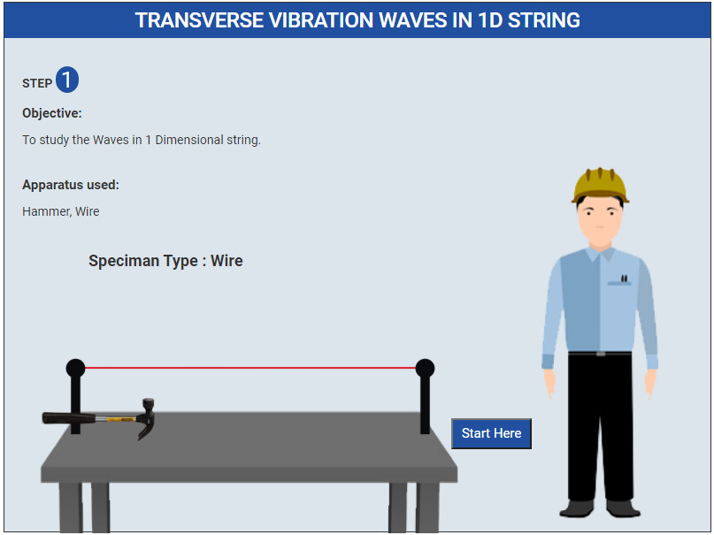

2. Select Following Parameters.
 
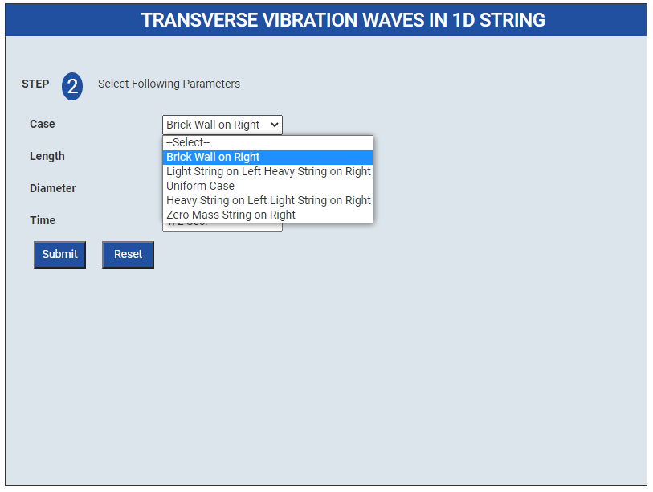

3. Click on Hammer to hit on the wire.
 
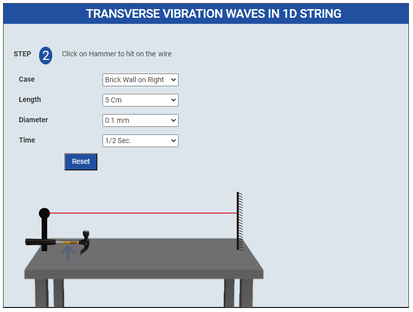

4. Show the Graphs.
 
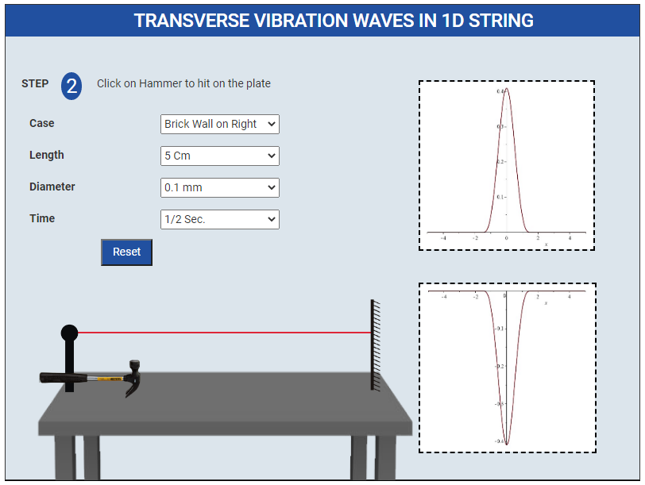

**Light String on Left Heavy String on Right**

1. Select Following Parameters.
 
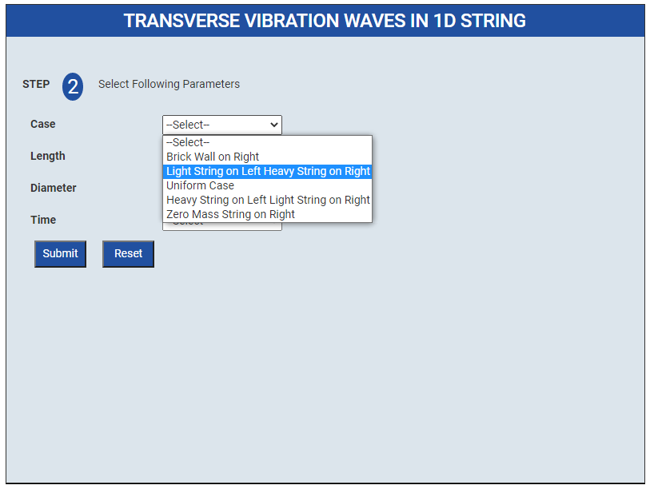

2. Click on Hammer to hit on the wire.
 
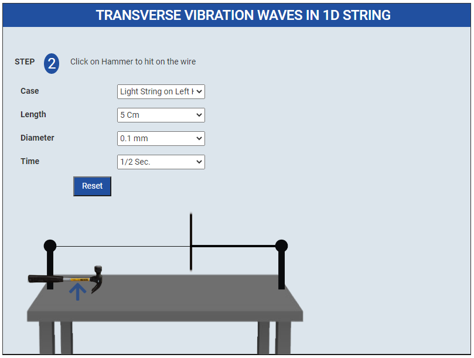

3. Show the Graphs.
 
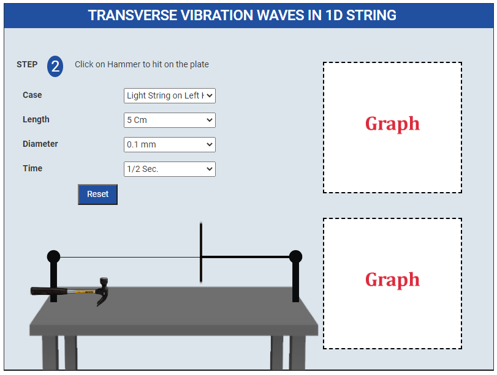

**Uniform Case**

1. Select Following Parameters.
 
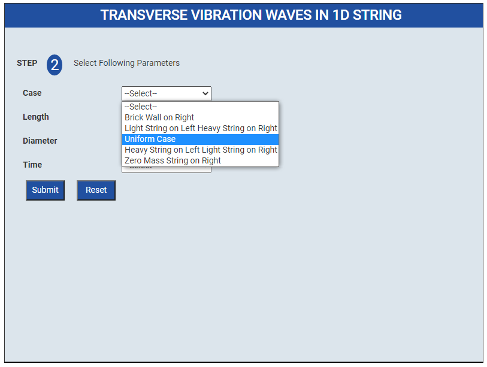

2. Click on Hammer to hit on the wire
 
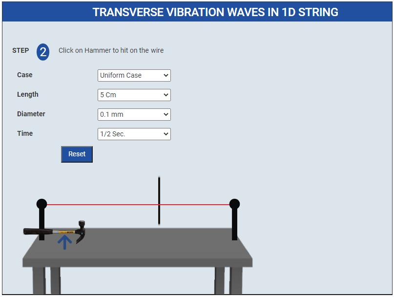

3. Show the Graphs
 
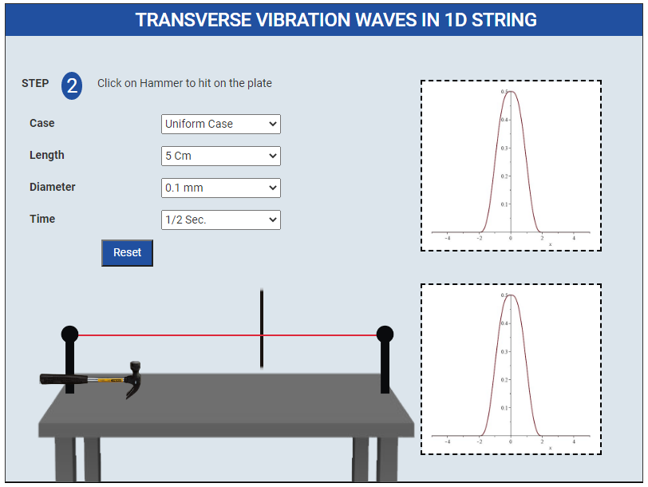

**Heavy String on Left Light String on Right**

1. Select Following Parameters.
 
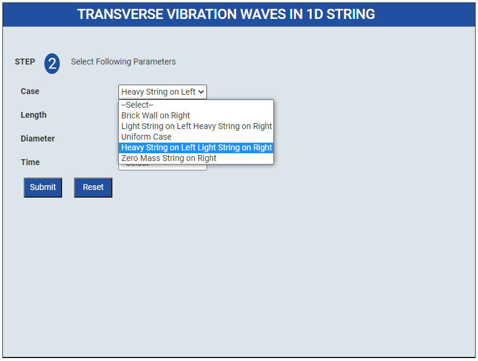

2. Click on Hammer to hit on the wire
 
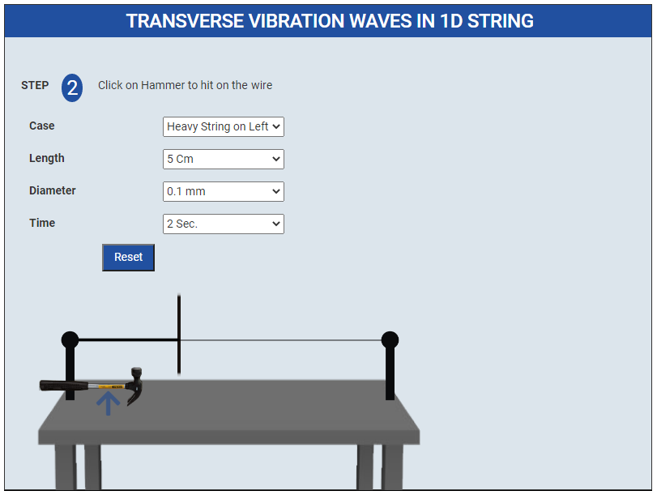

3. Show the Graphs
 
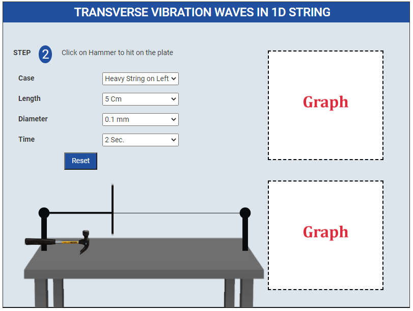

**Zero Mass String on Right**

1. Select Following Parameters.
 
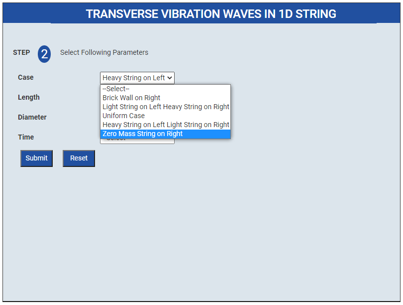

2. Click on Hammer to hit on the wire
 

3. Show the Graphs
 
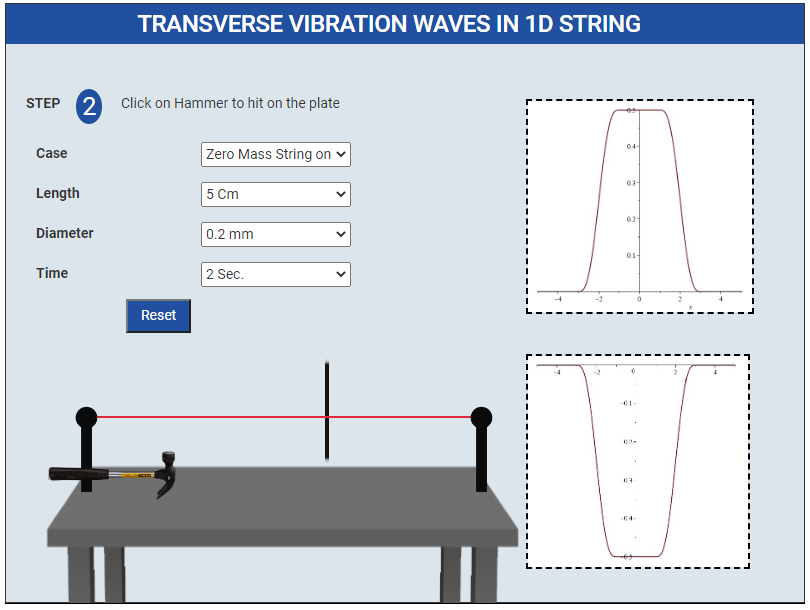

